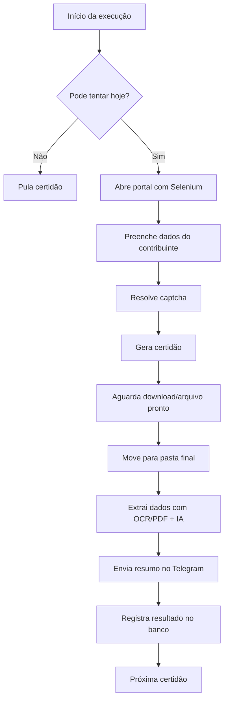

# Automação de Certidões Negativas (CND) com IA


Robô RPA para **emissão, download, organização, leitura e monitoramento de Certidões Negativas de Débitos (CNDs)**. O projeto automatiza consultas em portais públicos, resolve captchas via Anti-Captcha, processa PDFs/imagens com OCR e extração assistida por IA, registra tentativas em SQL Server e envia notificações operacionais pelo Telegram.

> Projeto orientado a rotinas fiscais/administrativas que exigem recorrência, rastreabilidade e padronização no armazenamento de certidões.

---

## Sumário

- [Visão geral](#visão-geral)
- [Certidões automatizadas](#certidões-automatizadas)
- [Principais recursos](#principais-recursos)
- [Arquitetura do fluxo](#arquitetura-do-fluxo)
- [Estrutura do projeto](#estrutura-do-projeto)
- [Pré-requisitos](#pré-requisitos)
- [Configuração do ambiente](#configuração-do-ambiente)
- [Variáveis de ambiente](#variáveis-de-ambiente)
- [Banco de dados](#banco-de-dados)
- [Execução](#execução)
- [Saídas geradas](#saídas-geradas)
- [Boas práticas operacionais](#boas-práticas-operacionais)
- [Troubleshooting](#troubleshooting)
- [Roadmap sugerido](#roadmap-sugerido)

---

## Visão geral

A automação central está no arquivo `main.py` e executa uma esteira completa para cada certidão configurada:

1. **Verifica no banco** se a certidão ainda pode ser processada no dia.
2. **Abre o portal oficial** com Selenium e ChromeDriver.
3. **Preenche os dados cadastrais** a partir do arquivo `.env`.
4. **Resolve captcha** por imagem ou reCAPTCHA via Anti-Captcha.
5. **Gera o documento** em PDF ou captura de tela, conforme o portal.
6. **Aguarda o arquivo ficar pronto** antes de mover/processar.
7. **Extrai metadados** como número, emissão e validade usando `pdfplumber`, EasyOCR e LLM.
8. **Move o arquivo final** para uma árvore de pastas por ano e mês.
9. **Envia notificação** com resumo e caminho do arquivo via Telegram.
10. **Registra sucesso/falha** no SQL Server para controle de tentativas.

---

## Certidões automatizadas

| Certidão | Portal / origem | Saída esperada | Extração de dados |
|---|---|---:|---|
| Dívida Ativa do Estado de SP | PGE-SP | PDF | Número, emissão e validade |
| FGTS / CRF | Caixa Econômica Federal | Imagem/PDF conforme fluxo do portal | Número, emissão e validade |
| Trabalhista | TST / CNDT | PDF | Número, emissão e validade |
| Municipal | Portal de Diadema | Captura de tela (`.png`) | Emissão e validade |

---

## Principais recursos

- **Automação web com Selenium** e ChromeDriver gerenciado por `webdriver-manager`.
- **Resolução de captchas** com Anti-Captcha para imagens e reCAPTCHA.
- **Processamento inteligente de documentos** com `pdfplumber`, EasyOCR e cliente OpenAI-compatible.
- **Organização automática de arquivos** por tipo de certidão, ano e mês.
- **Controle de tentativas** para evitar reprocessamento infinito no mesmo dia.
- **Registro operacional em SQL Server** na tabela `dbo.cnd_testes`.
- **Alertas e resumos via Telegram** para sucesso, falhas e erros operacionais.
- **Tratamento de arquivos em download** para evitar leitura/movimentação de PDFs incompletos ou bloqueados.

---

## Arquitetura do fluxo



---

## Estrutura do projeto

```text
.
├── main.py                 # Orquestra a emissão das certidões e o fluxo completo do robô
├── chatchef.py             # Cliente LLM e funções auxiliares de extração via PDF/OCR + IA
├── config_banco.py         # Funções independentes para logs e controle de tentativas em SQL Server
├── telegram_solution.py    # Envio de mensagens e imagens pelo Telegram
├── requirements.txt        # Dependências Python do projeto
└── README.md               # Documentação do projeto
```

> **Observação de compatibilidade:** o `main.py` utiliza nomes de importação legados (`Solution_bank`, `Solution_telegram` e `Solution_file_ia`). Caso execute este snapshot diretamente, mantenha esses módulos disponíveis no ambiente ou ajuste os imports para os arquivos versionados (`config_banco.py`, `telegram_solution.py` e `chatchef.py`), conforme o padrão adotado na sua implantação.

---

## Pré-requisitos

Antes de executar, garanta que o ambiente possui:

- **Python 3.9+**.
- **Google Chrome** instalado.
- **Acesso à internet** para navegação nos portais públicos e APIs externas.
- **Conta Anti-Captcha** com saldo disponível.
- **Bot do Telegram** criado e `chat_id` configurado.
- **SQL Server** acessível pela máquina de execução.
- **ODBC Driver 17 for SQL Server** instalado.
- **Credencial de IA** compatível com o cliente `OpenAI` usado pelo `ChatChef`.
- Permissão de escrita no diretório definido em `BASE_PATH`.

---

## Configuração do ambiente

### 1. Clone o repositório

```bash
git clone <url-do-repositorio>
cd Nova_Branch-Cnd_IA-
```

### 2. Crie e ative um ambiente virtual

**Windows**

```powershell
python -m venv .venv
.\.venv\Scripts\activate
```

**Linux/macOS**

```bash
python3 -m venv .venv
source .venv/bin/activate
```

### 3. Instale as dependências

```bash
python -m pip install --upgrade pip
pip install -r requirements.txt
```

> Se sua implantação usar `chatchef.py` e `telegram_solution.py` diretamente, confirme também a presença das bibliotecas `openai` e `python-telegram-bot`, pois esses módulos são importados no código-fonte.

---

## Variáveis de ambiente

Crie um arquivo `.env` na raiz do projeto. Nunca versione esse arquivo, pois ele contém credenciais e dados sensíveis.

```env
# Dados do contribuinte
CNPJ_BASE=12345678
CNPJ_BASICO=12345678
CNPJ_SC=12345678000199
CPF=12345678900
NOME=Nome do Solicitante

# Anti-Captcha
CHAVE_API_CAPTCHA=xxxxxxxxxxxxxxxxxxxxxxxxxxxxxxxx

# IA / LLM
CHAVE_OPENIA=sk-xxxxxxxxxxxxxxxxxxxxxxxxxxxxxxxx

# Telegram
ITOKEN_TELEGRAM=000000000:xxxxxxxxxxxxxxxxxxxxxxxxxxxx
CHAT_ID=123456789

# SQL Server
DB_USER=usuario
DB_PASS=senha
DB_HOST=servidor-ou-ip
DB_NAME=nome_do_banco

# Armazenamento dos documentos
BASE_PATH=C:\Robos\Certidoes
```

### Descrição das variáveis

| Variável | Obrigatória | Descrição |
|---|---:|---|
| `CNPJ_BASE` | Sim | Base do CNPJ usada em fluxos específicos. |
| `CNPJ_BASICO` | Sim | Raiz/base do CNPJ usada em portais que pedem apenas o básico. |
| `CNPJ_SC` | Sim | CNPJ completo usado nas consultas. |
| `CPF` | Sim | CPF do solicitante para portais que exigem identificação. |
| `NOME` | Sim | Nome do solicitante. |
| `CHAVE_API_CAPTCHA` | Sim | Chave da API Anti-Captcha. |
| `CHAVE_OPENIA` | Sim | Chave da API de IA usada pelo `ChatChef`. |
| `ITOKEN_TELEGRAM` | Sim | Token do bot Telegram. |
| `CHAT_ID` | Sim | ID do chat/grupo que receberá os alertas. |
| `DB_USER` | Sim | Usuário do SQL Server. |
| `DB_PASS` | Sim | Senha do SQL Server. |
| `DB_HOST` | Sim | Host/IP/instância do SQL Server. |
| `DB_NAME` | Sim | Nome do banco de dados. |
| `BASE_PATH` | Sim | Diretório raiz onde os arquivos finais serão organizados. |

---

## Banco de dados

O robô espera uma tabela para controlar tentativas e resultados diários. Um modelo mínimo é:

```sql
CREATE TABLE dbo.cnd_testes (
    id INT IDENTITY(1,1) PRIMARY KEY,
    nome_certidao VARCHAR(100) NOT NULL,
    data_execucao DATETIME NOT NULL,
    tentativas INT NOT NULL,
    resultado BIT NOT NULL
);
```

### Regra de controle

- Cada certidão é verificada por `nome_certidao` e data de execução.
- Se já houve **sucesso** no dia, a certidão não é executada novamente.
- Se já ocorreram **3 tentativas sem sucesso**, a certidão também é bloqueada para novas tentativas naquele dia.
- Em caso de nova tentativa permitida, o contador é atualizado no banco.

---

## Execução

Com o ambiente virtual ativo e o `.env` configurado:

```bash
python main.py
```

A execução padrão percorre as certidões nesta ordem:

1. `divida_ativa`
2. `fgts`
3. `trabalhista`
4. `municipal`

Cada etapa pode tentar até 3 vezes antes de registrar falha definitiva para o dia.

---

## Saídas geradas

Os documentos são organizados automaticamente dentro de `BASE_PATH`, separados por tipo, ano e mês:

```text
BASE_PATH/
├── CND - Divida Ativa/
│   └── 2026/
│       └── 05 - Maio/
├── CND_FGTS/
│   └── 2026/
│       └── 05 - Maio/
├── CND - Trabalhista/
│   └── 2026/
│       └── 05 - Maio/
└── CND - Municipal/
    └── 2026/
        └── 05 - Maio/
```

Ao final de cada certidão, o Telegram recebe uma mensagem com o status e, quando disponível, número, emissão, validade e caminho do arquivo salvo.

---

## Boas práticas operacionais

- Execute o robô em uma máquina com **Chrome atualizado** e conexão estável.
- Mantenha saldo suficiente na conta Anti-Captcha antes da rotina diária.
- Monitore mudanças nos portais públicos, pois alterações de layout podem exigir ajuste de seletores Selenium.
- Proteja o `.env` com permissões restritas e nunca compartilhe tokens ou senhas.
- Faça backup periódico do diretório `BASE_PATH` e da tabela de logs.
- Prefira executar a rotina por agendador controlado, como **Task Scheduler**, **cron** ou orquestrador corporativo.

---

## Troubleshooting

| Sintoma | Possível causa | Ação recomendada |
|---|---|---|
| `ModuleNotFoundError` ao iniciar | Dependência ausente ou imports legados sem módulo correspondente | Instale dependências e valide nomes dos módulos utilizados pela implantação. |
| Chrome não abre | Chrome ausente/desatualizado ou bloqueio do ambiente | Atualize o Chrome e valide permissões de execução. |
| Captcha não resolve | Saldo insuficiente, chave inválida ou instabilidade da API | Verifique `CHAVE_API_CAPTCHA`, saldo e resposta da API. |
| PDF não encontrado | Download incompleto, portal alterado ou diretório incorreto | Confira pasta de downloads, seletores Selenium e permissões de escrita. |
| Erro de banco | Driver ODBC ausente, credenciais inválidas ou tabela inexistente | Instale ODBC Driver 17, teste conexão e crie `dbo.cnd_testes`. |
| Telegram não recebe mensagem | Token/chat inválido ou bot sem permissão no grupo | Valide `ITOKEN_TELEGRAM`, `CHAT_ID` e permissões do bot. |
| Dados extraídos como “Não encontrado” | PDF sem texto, OCR insuficiente ou prompt sem contexto | Verifique qualidade do documento e o retorno do OCR/PDF. |

---

## Roadmap sugerido

- [ ] Padronizar nomes de módulos e imports para eliminar aliases legados.
- [ ] Adicionar `.env.example` sem dados sensíveis.
- [ ] Criar testes unitários para extração de datas, validação de caminhos e regras de tentativas.
- [ ] Separar cada certidão em um módulo próprio para facilitar manutenção.
- [ ] Adicionar logging estruturado em arquivo além do Telegram.
- [ ] Criar modo `--dry-run` para validar ambiente sem emitir certidões reais.
- [ ] Containerizar a aplicação com dependências de Chrome/ODBC documentadas.

---

## Aviso importante

Este projeto automatiza acessos a portais públicos e integra serviços externos. Antes de utilizar em produção, valide conformidade com políticas internas, termos de uso dos portais consultados, LGPD e regras de segurança da organização.
